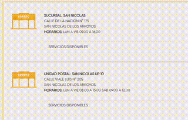

## Address Map Popup (with Google Maps API)

Highlight an address or coordinates on any webpage to see a small pin next to your selection. Hover the pin to expand an embedded Google Map that searches for the selected text.



## Features

- **Auto-detection**: Heuristic scoring identifies likely addresses and coordinates you highlight.
- **Lightweight UI**: Compact pin expands on hover; closes on Esc or click outside.
- **Works everywhere**: Runs on all sites without additional configuration.

## Requirements

- **Google Maps Embed API key**: Stored locally using Chrome sync storage.

## Install

1. Download/clone the repository.
2. Open Chrome → `chrome://extensions/`.
3. Enable Developer Mode.
4. Click “Load unpacked” and select this folder.

## Setup

1. Click the extension icon to open `popup.html`.
2. Paste your Google Maps API key and click Save.

## Use

1. Select text that contains an address or coordinates.
2. A small 📍 pin appears near the selection if the text looks like a location.
3. Hover the pin to load an embedded Google Map search for the selected text.

## Supported inputs (examples)

- Street addresses: `123 Main St, New York, NY 10001`
- Decimal coordinates: `40.7128, -74.0060`
- DMS coordinates: `40°42'46"N 74°00'21"W`

## How it works

- On mouseup, the selected text is scored by `detectAddressConfidence`. If it exceeds the threshold, a pin is shown.
- On hover, an `<iframe>` is created with Google Maps Embed Search using the exact selected text.
- The API key is read from `chrome.storage.sync`.

## Permissions

- `activeTab`: Read the highlighted selection to decide whether to show the pin.
- `storage`: Save and load the Google Maps API key.

## Files

```
manifest.json     # MV3 configuration
content.js        # Detect selection, show pin, embed map on hover
content.css       # Popup styling (compact/expanded states)
popup.html        # API key input UI
popup.js          # Save/load API key via chrome.storage.sync
background.js     # Optional helper (not required for basic use)
README.md         # This file
```

## Privacy

- Only the text you highlight is used.
- The highlighted text is sent to Google Maps via the embedded map URL.
- The API key is stored locally in Chrome sync storage.

## Troubleshooting

- **No map appears**: Ensure you saved a valid Google Maps Embed API key.
- **Pin doesn’t show**: The text may not score as an address; try a more complete format.
- **Close the popup**: Press Esc or click anywhere outside the popup.